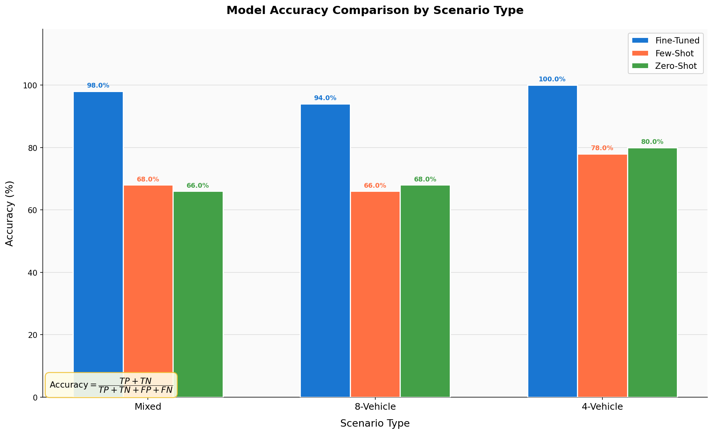
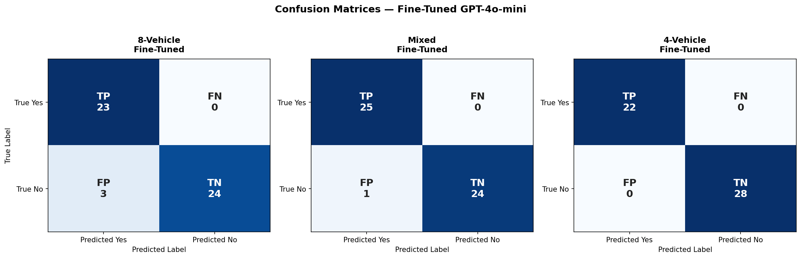
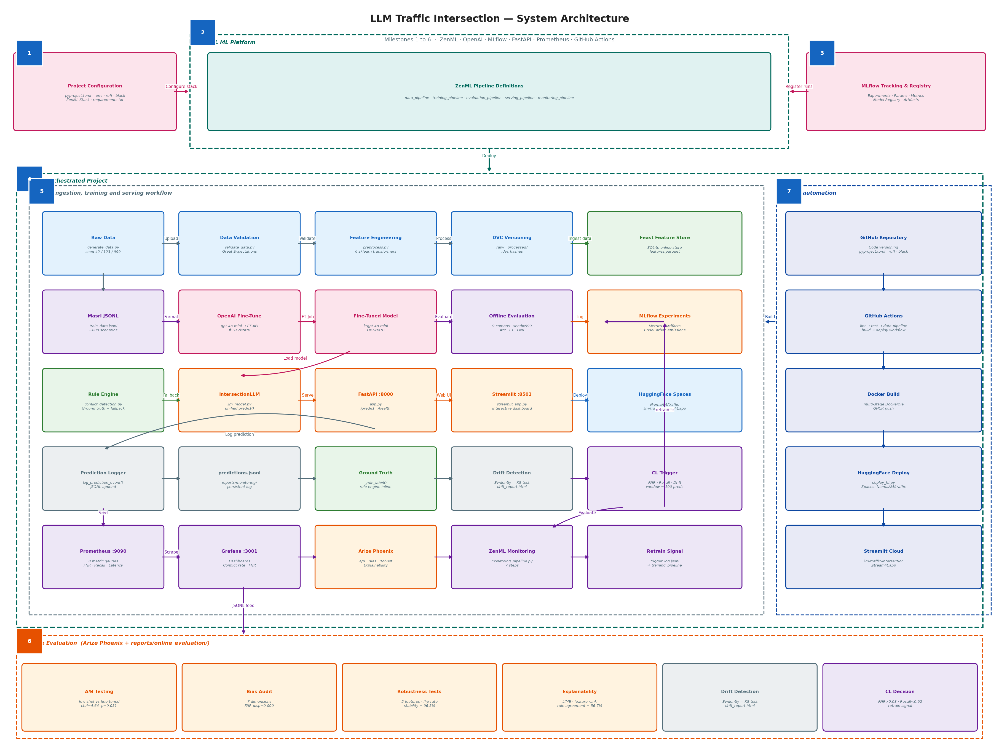
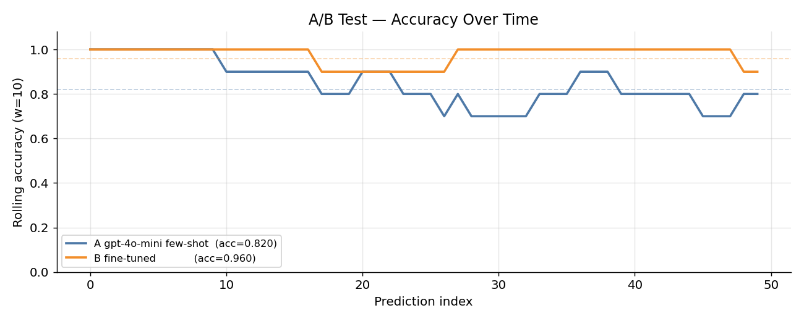
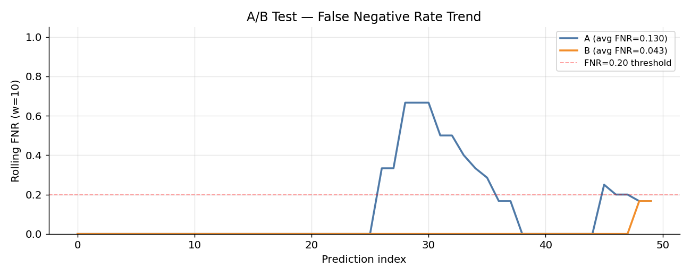
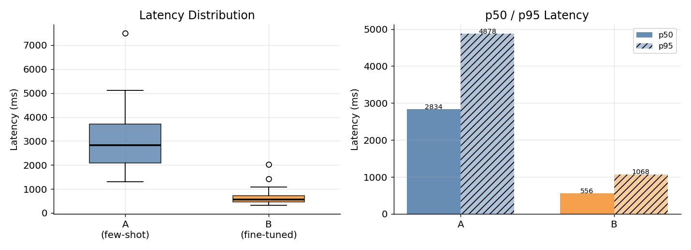
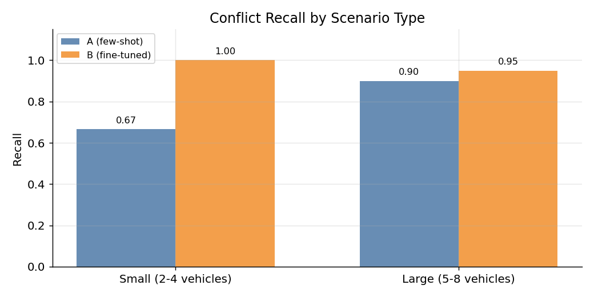
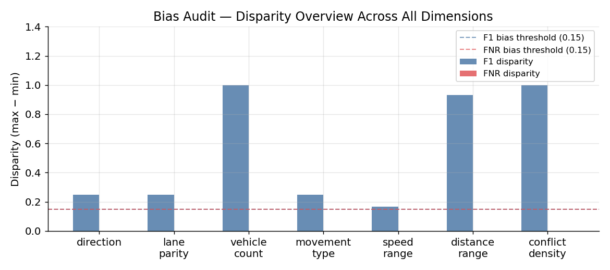
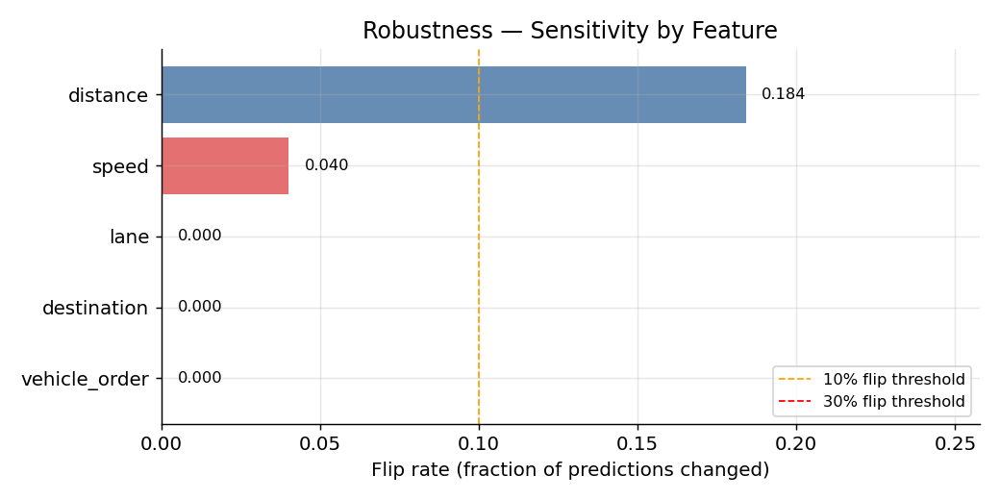
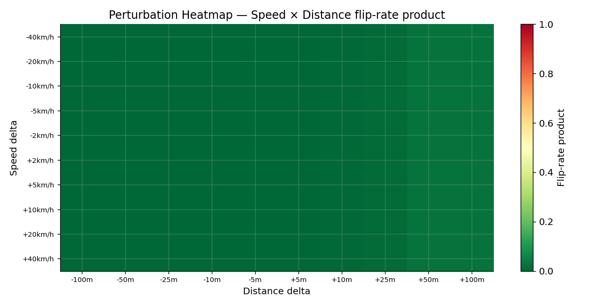

# LLM-Driven Agents for Traffic Intersection Conflict Resolution
### Full Project Report: Milestones 1 to 6

> **Repository:** [github.com/NiemaAM/llm-traffic-intersection](https://github.com/NiemaAM/llm-traffic-intersection)
> **Model:** `ft:gpt-4o-mini-2024-07-18:personal::DX7kzKtB`
> **Course:** CSC5382 - AI for Digital Transformation

---

## Table of Contents

- [1. Milestone 1: Project Inception](#1-milestone-1-project-inception)
  - [1.1 Framing the Business Idea as an ML Problem](#11-framing-the-business-idea-as-an-ml-problem)
  - [1.2 Feasibility Analysis](#12-feasibility-analysis)
- [2. Milestone 2: Development of Proof-of-Concepts](#2-milestone-2-development-of-proof-of-concepts)
- [3. Milestone 3: Data Ingestion, Validation and Preparation](#3-milestone-3-data-ingestion-validation-and-preparation)
- [4. Milestone 4: Model Training and Offline Evaluation](#4-milestone-4-model-training-and-offline-evaluation)
- [5. Milestone 5: Model Productionization](#5-milestone-5-model-productionization)
  - [5.1 ML System Architecture](#51-ml-system-architecture)
  - [5.2 Application Development](#52-application-development)
  - [5.3 Integration and Deployment](#53-integration-and-deployment)
  - [5.4 Model Serving](#54-model-serving)
- [6. Milestone 6: Model Testing, Monitoring and Continual Learning](#6-milestone-6-model-testing-monitoring-and-continual-learning)
  - [6.1 Model Evaluation and Testing](#61-model-evaluation-and-testing)
  - [6.2 Testing Beyond Accuracy](#62-testing-beyond-accuracy)
  - [6.3 Model Monitoring and Continual Learning](#63-model-monitoring-and-continual-learning)

---

## 1. Milestone 1: Project Inception

### 1.1 Framing the Business Idea as an ML Problem

#### Business Case Description

Urban intersections are one of the most dangerous elements of road infrastructure. Multi-directional vehicle interactions, especially at uncontrolled or semi-controlled four-way intersections, result in conflicts that traditional rule-based traffic management systems handle with fixed-cycle logic, incapable of adapting to real-time vehicle counts, speeds, or directions.

This project frames intersection conflict detection as a **supervised binary classification problem** enriched with structured decision output. Given a set of vehicles approaching a four-way eight-lane intersection, the system must determine whether a conflict exists, which vehicles are involved, what the priority order is, and the estimated waiting time for each vehicle. The intersection geometry is fixed across four directions (North, East, South, West), two lanes per direction, and eight possible destinations (A to H).

#### Business Value of Using ML

| Value Driver | Description |
|---|---|
| **Safety** | Reducing False Negatives (missed conflicts) is the primary safety objective. A missed conflict could lead to a collision. |
| **Adaptability** | LLM-based reasoning adapts to arbitrary vehicle counts and configurations without hard-coded rule updates. |
| **Explainability** | Structured JSON output provides a natural language reasoning trace alongside the decision. |
| **Generalization** | A fine-tuned LLM generalizes across 2 to 8 vehicle scenarios without retraining for each cardinality. |
| **Scalability** | The same model can serve multiple intersection instances via a REST API with no infrastructure change. |

The primary business metric is **False Negative Rate (FNR)**, since a missed conflict is more dangerous than a false alarm. Accuracy and F1 are used as secondary metrics.

#### Data Overview

| Dataset | Source | Format | Size | Purpose |
|---|---|---|---|---|
| `data/raw/generated_dataset.csv` | Synthetic generator (seed=42) | CSV | ~1,000 vehicle records | Training base |
| `data/masri_finetune/train_data.jsonl` | Masri et al. format | JSONL | ~800 scenarios | Fine-tuning |
| `data/masri_finetune/eval_only_masri.csv` | Synthetic generator (seed=999) | CSV | 200+ scenarios | Leakage-free evaluation |
| `data/external/intersection_layout.json` | Hand-crafted | JSON | 53 lines | Intersection definition |
| `data/processed/features.csv` | Feature engineering pipeline | CSV | DVC-tracked | ML features |

Each record contains vehicle identifiers, lane number (1 to 8), speed in km/h, distance to the intersection in metres, direction (N/E/S/W), destination (A to H), and a binary conflict label (yes/no).

| Field | Role | Type | Valid Values | Description |
|---|---|---|---|---|
| `scenario_id` | Input | String | e.g. S001 | Groups vehicles belonging to the same scenario |
| `vehicle_id` | Input | String | e.g. V001–V008 | Unique vehicle identifier per scenario |
| `lane` | Input | Integer | 1–8 | Approach lane at the intersection |
| `speed` | Input | Float | > 0 km/h | Vehicle approach speed |
| `distance_to_intersection` | Input | Float | > 0 m | Distance from the stop line |
| `direction` | Input | String | N, E, S, W | Approach direction |
| `destination` | Input | String | A–H | Exit destination |
| `is_conflict` | **Output** | String | yes / no | Binary conflict label (ground truth) |
| `priority_order` | **Output** | Dict | {V_id: rank} | Right-of-way priority per vehicle |
| `waiting_times` | **Output** | Dict | {V_id: seconds} | Estimated waiting time per vehicle |

#### Project Archetype

This is a **human-in-the-loop** classification system using an LLM as the classifier, evaluated across three inference strategies: zero-shot classification (system prompt only, no examples), few-shot classification (four annotated examples appended to the prompt), and supervised fine-tuning on the Masri-format JSONL dataset. The human-in-the-loop element operates at two levels. First, training labels are generated by a deterministic rule engine that encodes domain expert knowledge about intersection right-of-way rules, meaning that expert judgment is embedded in the ground-truth generator rather than applied manually to each example. Second, in production, a human operator can review the structured JSON output, which includes the conflict reason, priority order, and waiting times, before acting on the conflict signal. The rule-based engine from [Masri et al. (2025)](https://github.com/NiemaAM/llm-traffic-intersection/blob/main/src/poc/conflict_detection_orig.py) serves as the ground-truth labeller for training data and as an authoritative reference for monitoring in production where no camera infrastructure is available.

---

### 1.2 Feasibility Analysis

#### Literature Review

| Reference | Contribution | Relevance |
|---|---|---|
| Masri et al. (2025) *arXiv:2411.10869* | LLM-based traffic conflict detection, rule-based engine, Masri fine-tuning format | Primary baseline - conflict engine reused directly |
| LLM-TrafficBrain (2025) | Multi-agent LLM for intersection control | Architecture inspiration |
| LLMLight (2025) | LLM for traffic signal optimization | Related work |
| LLM-DCTSC (2025) | LLM for distributed traffic signal control | Related work |

The Masri et al. paper established that gpt-4o-mini can achieve approximately 83% accuracy on 4-vehicle scenarios with fine-tuning. This project extends that baseline to 8-vehicle and mixed scenarios and adds a full MLOps pipeline around the model.

#### Model Choice and Baseline Specification

| Model | Mode | Description |
|---|---|---|
| **Rule engine** | Deterministic | Masri et al. `conflict_detection_orig.py` - O(n²) conflict pair checking. Serves as ground truth. |
| **Zero-Shot LLM** | `gpt-4o-mini` | System prompt only, no examples |
| **Few-Shot LLM** | `gpt-4o-mini` | System prompt + 4 annotated examples |
| **Fine-Tuned LLM** | `ft:gpt-4o-mini-2024-07-18:personal::DX7kzKtB` | OpenAI supervised fine-tuning on Masri-format JSONL |

The system prompt provided to the LLM describes the intersection geometry in natural language, specifying which lane leads to which destinations. This structured prompt gives the model all the contextual information it needs to reason about lane overlap without camera data:

```
You are an Urban Intersection Traffic Conflict Detector, responsible for
monitoring a four-way intersection with traffic coming from the north, east,
south, and west. Each direction has two lanes guiding vehicles to different
destinations:

- North: Lane 1 directs vehicles to F and H, Lane 2 directs vehicles to E, D, and C.
- East:  Lane 3 leads to H and B, Lane 4 leads to G, E, and F.
- South: Lane 5 directs vehicles to B and D, Lane 6 directs vehicles to A, G, and H.
- West:  Lane 7 directs vehicles to D and F, Lane 8 directs vehicles to B, C, and A.

Respond only with 'yes' or 'no'.
```

#### Metrics for Business Goal Evaluation

| Metric | Formula | Threshold | Rationale |
|---|---|---|---|
| **FNR** (primary) | FN / (FN + TP) | < 0.08 | Missed conflict = safety failure |
| **Recall** | TP / (TP + FN) | > 0.92 | Must detect most real conflicts |
| **F1** | 2·P·R / (P+R) | > 0.85 | Balanced precision/recall |
| **Accuracy** | (TP+TN) / Total | > 0.90 | Overall correctness |
| **Latency p50** | Median response time | < 3,000 ms | Real-time usability |
| **JSON validity** | Valid outputs / Total | > 0.98 | Serving reliability |
| **Rule agreement** | LLM == rule engine | > 0.75 | Interpretability proxy |

---

## 2. Milestone 2: Development of Proof-of-Concepts

### Model Integration

The proof-of-concept integrates the rule-based engine from [`src/poc/conflict_detection_orig.py`](https://github.com/NiemaAM/llm-traffic-intersection/blob/main/src/poc/conflict_detection_orig.py) with a Streamlit interface. The engine performs O(n²) conflict pair analysis using lane destination overlap as the conflict criterion. Given a set of vehicles, it detects which pairs share a destination (indicating crossing paths), assigns right-of-way priorities, and computes waiting times.

The [`IntersectionLLM`](https://github.com/NiemaAM/llm-traffic-intersection/blob/main/src/models/llm_model.py) class wraps both the rule engine and the OpenAI API under a unified `predict()` interface. When using the fine-tuned model, the LLM produces a "yes/no" response in Masri format, and the rule engine then fills in the full structured output (priority order, waiting times). When using zero-shot or few-shot mode, the LLM generates the full JSON decision directly.

### App Development

The PoC Streamlit app ([`src/poc/poc_app.py`](https://github.com/NiemaAM/llm-traffic-intersection/blob/main/src/poc/poc_app.py)) allows interactive scenario building with vehicle parameter sliders for direction, lane, speed, distance, and destination. The app performs real-time rule-based conflict detection, renders an animated Plotly intersection visualization, and supports JSON import and export for reproducible scenario sharing.

### End-to-End Scenario Testing

A complete scenario flows from raw vehicle parameters through the conflict detection logic to a structured JSON decision. As a concrete example, two vehicles are defined: Vehicle V001 approaches from the north via Lane 1 with destination F, and Vehicle V002 approaches from the east via Lane 3 with destination H. Both Lane 1 and Lane 3 lead to destination H, establishing a lane-destination overlap and therefore a conflict. The expected system output identifies the conflict, assigns V002 priority (eastbound has right-of-way over northbound), and sets a 3-second waiting time for V001 while V002 proceeds immediately.

---

## 3. Milestone 3: Data Ingestion, Validation and Preparation

### Schema Definition

The canonical data schema is defined in [`src/data/validate_data.py`](https://github.com/NiemaAM/llm-traffic-intersection/blob/main/src/data/validate_data.py) and [`data/external/intersection_layout.json`](https://github.com/NiemaAM/llm-traffic-intersection/blob/main/data/external/intersection_layout.json). Each record requires eight fields: `scenario_id`, `vehicle_id`, `lane` (integer, 1 to 8), `speed` (positive float in km/h), `distance_to_intersection` (positive float in metres), `direction` (N, E, S, or W), `destination` (A to H), and `is_conflict` (yes or no). The lane-to-destination mapping is fixed by the intersection geometry and is enforced at validation time.

### Data Validation and Verification

Validation is performed in [`src/data/validate_data.py`](https://github.com/NiemaAM/llm-traffic-intersection/blob/main/src/data/validate_data.py) using Great Expectations as the primary validator with a custom schema fallback. The ZenML `validate_data` step enforces these checks before any downstream processing. Validated constraints include column presence, lane range (1 to 8), positive speed and distance values, valid direction and destination values, and consistency between each vehicle's declared lane and destination.

### Data Versioning

All raw and processed datasets are tracked with DVC. Each pipeline run that regenerates data commits a new DVC hash, creating a full audit trail of dataset versions. The DVC configuration ([`.dvc/config`](https://github.com/NiemaAM/llm-traffic-intersection/blob/main/.dvc/config)) defines the remote storage endpoint. Reproducing the full dataset from scratch requires only `dvc repro`, which re-executes the generation and validation steps in sequence.

### Feature Store

Feast is used as the feature store, configured in [`data/feature_store/`](https://github.com/NiemaAM/llm-traffic-intersection/tree/main/data/feature_store). Features are stored in a local SQLite online store, with the offline source pointing to the processed Parquet file. Five features are registered per vehicle entity: direction, speed, distance to intersection, lane, and destination. The feature store is materialized after each data pipeline run so that online inference always has access to the latest features.

### Data Pipeline within the ML Platform

The ZenML [`data_pipeline.py`](https://github.com/NiemaAM/llm-traffic-intersection/blob/main/src/pipelines/data_pipeline.py) orchestrates the full ingestion flow across five steps:

| Step | Function | Output |
|---|---|---|
| `ingest_data` | `generate_dataset(n=1000, seed=42)` | `data/raw/generated_dataset.csv` |
| `validate_data` | Schema + Great Expectations | Validated DataFrame |
| `engineer_features` | 6 sklearn transformers | `data/processed/features.csv` |
| `version_data` | `dvc commit` | DVC-tracked snapshot |
| `push_to_feature_store` | `feast materialize` | Feast SQLite online store |

#### Preprocessing and Feature Engineering

Six custom sklearn transformers are chained in [`src/features/preprocess.py`](https://github.com/NiemaAM/llm-traffic-intersection/blob/main/src/features/preprocess.py):

| Transformer | Input | Output |
|---|---|---|
| `DirectionEncoder` | `direction` (str) | Integer (N=0, E=1, S=2, W=3) |
| `ConflictFlagEncoder` | `is_conflict` (str) | Binary (0/1) |
| `WaitingTimeExtractor` | `waiting_times` (dict) | Numeric scalar |
| `PriorityExtractor` | `priority_order` (dict) | Numeric rank |
| `ScenarioAggFeatures` | Per-vehicle records | Aggregated scenario-level stats |
| `DropRawColumns` | Original string fields | Cleaned numeric DataFrame |

A `StandardScaler` is fit on training data and persisted to [`models/scaler.joblib`](https://github.com/NiemaAM/llm-traffic-intersection/blob/main/models/scaler.joblib) for consistent normalization at inference time.

---

## 4. Milestone 4: Model Training and Offline Evaluation

### Project Structure and Modularity

The repository follows the **Cookiecutter Data Science** template structure, adapted for an LLM-based inference project. The top-level layout separates concerns across `data/` (raw, processed, and external datasets), `src/` (all source code), `models/` (serialized model artifacts), `reports/` (evaluation outputs and figures), `tests/` (unit and integration tests), `deployment/` (Docker and Compose files), and `notebooks/` (exploratory analysis). Within `src/`, modules are organized by function: `api/` contains the FastAPI service and Streamlit dashboard, `data/` handles data generation and validation, `evaluation/` contains the Phoenix online evaluation scripts, `features/` implements feature engineering, `models/` defines the IntersectionLLM wrapper and training script, `monitoring/` manages prediction logging and drift detection, `pipelines/` contains the five ZenML pipeline definitions, `poc/` holds the proof-of-concept, and `utils/` contains utility scripts. Each module is independently importable and has its own entry points defined in [`setup.py`](https://github.com/NiemaAM/llm-traffic-intersection/blob/main/setup.py).

### Code Versioning

Code quality is enforced by [`pyproject.toml`](https://github.com/NiemaAM/llm-traffic-intersection/blob/main/pyproject.toml), which configures Ruff for linting, Black for formatting, isort for import sorting, and pytest with coverage reporting. The CI/CD pipeline enforces lint and tests on every push to the repository.

### Experiment Tracking and Model Versioning

MLflow tracks all experiments under the `traffic-intersection-llm` experiment. Each training run logs the model identifier, inference mode (zero-shot, few-shot, fine-tuned), scenario type, accuracy, FNR, and F1 at each evaluation step. The fine-tuned model ID is registered in the MLflow Model Registry and persisted to [`data/masri_finetune/fine_tuned_model_id.txt`](https://github.com/NiemaAM/llm-traffic-intersection/blob/main/data/masri_finetune/fine_tuned_model_id.txt).

### Model Training

The ZenML [`training_pipeline.py`](https://github.com/NiemaAM/llm-traffic-intersection/blob/main/src/pipelines/training_pipeline.py) orchestrates training across five steps: auditing class balance before training, converting the CSV dataset to the Masri JSONL format required by OpenAI fine-tuning, submitting the fine-tuning job to the OpenAI API, registering the resulting model ID to the MLflow Model Registry, and tracking energy consumption via CodeCarbon.

Each of the three inference strategies uses a different prompt format. The zero-shot model receives only the intersection geometry as a system prompt and a JSON vehicle list as the user message, producing a full structured JSON response:

```
# Zero-Shot prompt format
System: You are an Urban Intersection Traffic Conflict Detector...
        [intersection geometry with lane-destination mapping]
        Respond with a valid JSON: {"is_conflict": "yes"/"no",
          "vehicles": [...], "priority_order": {...}, "waiting_times": {...}}

User:   Scenario vehicles:
        V001 — lane 1, direction north, speed 60 km/h, distance 80 m, destination F
        V002 — lane 3, direction east,  speed 55 km/h, distance 75 m, destination H
        Is there a conflict?
```

The few-shot model extends the same system prompt with four manually annotated example pairs (one no-conflict scenario and three conflict scenarios of increasing complexity) inserted between the system prompt and the new scenario. These examples demonstrate the expected output format and show how lane-destination overlap leads to a conflict decision.

The fine-tuned model uses the **Masri format**, where the user message is a plain-text vehicle description and the expected completion is simply "yes" or "no". After the model predicts the conflict label, the rule engine reconstructs the full JSON output (priority order, waiting times) without any LLM generation:

```json
// Fine-tuned training record (Masri JSONL format)
{
  "messages": [
    {"role": "system",    "content": "You are a traffic conflict detector..."},
    {"role": "user",      "content": "Vehicle V001 in lane 1 heading north to F
                                      at 60 km/h, 80 m from intersection.
                                      Vehicle V002 in lane 3 heading east to H
                                      at 55 km/h, 75 m from intersection.
                                      Is there a conflict?"},
    {"role": "assistant", "content": "yes"}
  ]
}
```

### Offline Evaluation

The [`evaluation_pipeline.py`](https://github.com/NiemaAM/llm-traffic-intersection/blob/main/src/pipelines/evaluation_pipeline.py) evaluates all nine combinations (3 models × 3 scenario types) on `eval_only_masri.csv`, which was generated with seed=999 and was never used during training (training seeds were 42 and 123). This guarantees a leakage-free test set, enforced programmatically in the pipeline so that accidental seed reuse raises an assertion error at runtime. Results are written to `reports/offline_evaluation/`.

| Model | Scenario | Accuracy | F1 | FNR |
|---|---|---|---|---|
| Zero-Shot | 4-vehicle | 80.0% | 0.800 | 9.1% |
| Zero-Shot | 8-vehicle | 68.0% | 0.704 | 17.4% |
| Zero-Shot | Mixed | 66.0% | 0.679 | 28.0% |
| Few-Shot | 4-vehicle | 78.0% | 0.784 | 9.1% |
| Few-Shot | 8-vehicle | 66.0% | 0.712 | 8.7% |
| Few-Shot | Mixed | 68.0% | 0.733 | 12.0% |
| **Fine-Tuned** | **4-vehicle** | **100.0%** | **1.000** | **0.0%** |
| **Fine-Tuned** | **8-vehicle** | **94.0%** | **0.939** | **0.0%** |
| **Fine-Tuned** | **Mixed** | **98.0%** | **0.980** | **0.0%** |



The grouped bar chart above shows accuracy per scenario type (Mixed, 8-Vehicle, 4-Vehicle) for each of the three model variants, with the accuracy formula annotated directly on the figure. The fine-tuned model achieves near-perfect accuracy across all scenario types, with a 27.3 percentage point improvement over zero-shot on the mixed scenario. Most critically, the FNR drops to 0.0% for all fine-tuned runs, meaning the model misses zero real conflicts. The zero-shot model's 28% FNR on mixed scenarios represents an unacceptable safety risk in a real deployment. Few-shot reduces this to 12% but remains above the 8% safety threshold, confirming that supervised fine-tuning is necessary for this application.



The confusion matrices confirm the fine-tuned model's safety profile with zero false negatives across all three scenario types. The 8-vehicle matrix shows 3 false positives, where the model predicts a conflict when none exists. This is a conservative but safe error mode, since unnecessary vehicle stops are preferable to missed collision warnings. The 4-vehicle matrix is perfect with 100% accuracy and no errors of any kind.

### Energy Efficiency

Carbon emissions were tracked via CodeCarbon during the offline evaluation run:

| Metric | Value |
|---|---|
| CO2 emissions | 0.000822 kg (0.822 g) |
| Energy consumed | 0.001305 kWh |
| Duration | 417.6 s (6.96 min) |
| CPU power | 1.65 W (CPU-only, no GPU) |
| Country | Morocco (Casablanca-Settat region) |
| Scenarios evaluated | 150 (50 per scenario type) |

The evaluation of 150 scenarios across three models consumed less than 1.3 Wh of energy and emitted under 1 gram of CO2. Full results are available at [`reports/offline_evaluation/emission_report.json`](https://github.com/NiemaAM/llm-traffic-intersection/blob/main/reports/offline_evaluation/emission_report.json).

---

## 5. Milestone 5: Model Productionization

### 5.1 ML System Architecture

The diagram below shows the full system spanning all six milestones, from data ingestion and training through serving, monitoring, and CI/CD:



The data layer feeds a synthetic generator through Great Expectations validation, sklearn feature engineering, DVC versioning, and into a Feast feature store. The training layer uses ZenML to orchestrate OpenAI fine-tuning and logs all results to MLflow. The serving layer exposes a FastAPI REST API backed by the IntersectionLLM wrapper, which falls back to the rule engine on OpenAI API failure. The monitoring layer scrapes Prometheus metrics into Grafana dashboards and runs Phoenix online evaluations. The CI/CD layer automates lint, testing, Docker image builds, and deployment to HuggingFace Spaces via GitHub Actions.

### 5.2 Application Development

#### Serving Mode

This project implements on-demand serving to a machine via a REST API and on-demand serving to a human via a Streamlit dashboard. Batch serving is not implemented, as the use case requires real-time intersection decisions.

| Mode | Implementation | Port |
|---|---|---|
| On-demand (machine) | FastAPI `/predict` endpoint | 8000 |
| On-demand (human) | Streamlit web dashboard | 8501 |

#### Model Service

The FastAPI service ([`src/api/app.py`](https://github.com/NiemaAM/llm-traffic-intersection/blob/main/src/api/app.py)) exposes a `/predict` endpoint that accepts a list of vehicles in JSON format and returns the full decision structure including conflict status, priority order, and waiting times per vehicle. It also exposes a `/health` endpoint for readiness checks. The service logs every prediction to Prometheus and appends it to the JSONL prediction log. On OpenAI API failure, it falls back to the rule engine so the endpoint never returns an empty response.

#### Front-End Client

The Streamlit dashboard ([`src/api/streamlit_app.py`](https://github.com/NiemaAM/llm-traffic-intersection/blob/main/src/api/streamlit_app.py)) provides an interactive vehicle scenario builder with sliders, makes a real-time POST to the FastAPI endpoint, and displays the conflict status, priority order, and waiting times per vehicle. A prediction history log is maintained in the session for comparison across scenarios.

### 5.3 Integration and Deployment

#### Containerization

The [`deployment/docker/Dockerfile`](https://github.com/NiemaAM/llm-traffic-intersection/blob/main/deployment/docker/Dockerfile) uses a multi-stage build to keep the production image small. The first stage installs all Python dependencies; the second stage copies only the installed packages and application code, creates a non-root user, and sets the container health check. The Docker Compose stack runs five services:

| Service | Image | Port | Purpose |
|---|---|---|---|
| `api` | Local build | 8000 | FastAPI inference |
| `streamlit` | Local build | 8501 | Web UI |
| `mlflow` | `ghcr.io/mlflow/mlflow` | 5000 | Experiment tracking |
| `prometheus` | `prom/prometheus` | 9090 | Metrics scraping |
| `grafana` | `grafana/grafana` | 3001 | Monitoring dashboards |

#### CI/CD Pipeline

The [`.github/workflows/ci_cd.yml`](https://github.com/NiemaAM/llm-traffic-intersection/blob/main/.github/workflows/ci_cd.yml) defines five sequential jobs. The lint job runs Ruff, Black, and isort checks. The test job runs pytest with coverage reporting. The data-pipeline job regenerates and validates the dataset on pushes to the main branch. The docker-build job builds the multi-stage image and pushes it to the GitHub Container Registry. The deploy-hf job deploys the Streamlit dashboard to HuggingFace Spaces. Each job is a prerequisite for the next, ensuring only validated, tested, and packaged code reaches production.

#### Hosting

The application is deployed to two public endpoints. The primary Streamlit deployment is available at [llm-traffic-intersection.streamlit.app](https://llm-traffic-intersection.streamlit.app/), providing a zero-install interactive interface for scenario testing. The HuggingFace Spaces deployment at [huggingface.co/spaces/NiemaAM/traffic-intersection](https://huggingface.co/spaces/NiemaAM/traffic-intersection) hosts the same Streamlit app and is updated automatically by the CI/CD pipeline via [`scripts/deploy_hf.py`](https://github.com/NiemaAM/llm-traffic-intersection/blob/main/scripts/deploy_hf.py). Docker images are published to the GitHub Container Registry for self-hosted containerized deployment.

### 5.4 Model Serving

The [`serving_pipeline.py`](https://github.com/NiemaAM/llm-traffic-intersection/blob/main/src/pipelines/serving_pipeline.py) validates the service before promoting a model to production across four steps:

| Step | Action |
|---|---|
| `load_best_model` | Read best model ID from MLflow `model-comparison` run |
| `validate_api` | POST /predict and GET /health with timeout assertions |
| `run_api_tests` | pytest tests/integration/test_api.py - 12 tests |
| `register_serving` | Log model config and latency metrics to MLflow |

---

## 6. Milestone 6: Model Testing, Monitoring and Continual Learning

### 6.1 Model Evaluation and Testing

#### Build a Test Set

The evaluation dataset was generated with seed=999, which was never used during training (training seeds: 42 and 123). This guarantees a leakage-free test set, enforced programmatically in the pipeline so that any accidental seed reuse raises an assertion error at runtime. The test set contains over 200 scenarios balanced across conflict classes and vehicle counts.

#### Online Testing: A/B Testing

The model comparison ([`src/evaluation/phoenix_ab_test.py`](https://github.com/NiemaAM/llm-traffic-intersection/blob/main/src/evaluation/phoenix_ab_test.py)) uses a **shadow paired design**: both Model A (few-shot gpt-4o-mini) and Model B (fine-tuned) are called on the exact same 50 scenarios, making metrics directly comparable without confounding from scenario difficulty. In production, only Model B's output is returned to the user; Model A runs silently in parallel. A deterministic MD5-based traffic router is implemented to simulate a 15%/85% production traffic split for realistic routing behaviour, but it does not gate which scenarios each model sees during this evaluation.

**Shadow Paired Test Results (n=50 scenarios, same scenarios for both models):**

| Metric | Model A (Few-Shot) | Model B (Fine-Tuned) | Delta |
|---|---|---|---|
| Accuracy | 80.0% | **96.0%** | +16 pp |
| F1 | 0.792 | **0.957** | +0.165 |
| FNR | 17.4% | **4.4%** | -13 pp |
| Recall | 82.6% | **95.7%** | +13.1 pp |
| Latency p50 | 4,539 ms | **1,822 ms** | -2,717 ms |
| JSON validity | 100% | 100% | 0 |
| Rule disagree rate | 50.0% | 46.0% | -4 pp |

Statistical significance was confirmed with a chi-squared value of 4.640 and p = 0.031, which is significant at the 0.05 level. Model B is the winner on every metric.



The rolling accuracy chart shows both models evaluated on the same 50 scenarios. Model B maintains consistently higher rolling accuracy throughout the evaluation sequence. Model A shows higher variance and dips below 0.70 in segments with predominantly 8-vehicle scenarios, confirming its weakness on complex configurations. Model B stabilizes above 0.95 after the first 10 scenarios, demonstrating more reliable performance on difficult cases.



The FNR trend is the most safety-critical result in this report. Model A's rolling FNR reaches peaks above 0.40, meaning 40% of real conflicts are missed in difficult scenario clusters. Model B stays near zero throughout, with brief spikes that immediately recover. Model A crosses the safety warning threshold frequently, while Model B does not exceed it during the entire rolling evaluation window. This confirms that the fine-tuned model is the only viable option for safety-critical deployment.



Model B has a significantly lower median latency (1,822 ms vs 4,539 ms). This result is counterintuitive since fine-tuning does not change the model's compute cost. The explanation is that the Masri fine-tuning format requires only a "yes/no" response of at most 5 output tokens, while Model A must generate a full JSON structure of over 300 tokens. Shorter generation produces lower latency. The Mann-Whitney U test confirms this difference is statistically significant (p = 0.000).



Model A's recall on small scenarios (2 to 4 vehicles) is only 66.7%, meaning it misses one in three real conflicts in the simplest cases. Model B achieves 100% recall on small scenarios and 95% on large ones. This confirms that the fine-tuning dataset's coverage of diverse vehicle counts generalizes well across cardinalities.

---

### 6.2 Testing Beyond Accuracy

#### Bias Audit

The bias audit ([`src/evaluation/phoenix_bias_audit.py`](https://github.com/NiemaAM/llm-traffic-intersection/blob/main/src/evaluation/phoenix_bias_audit.py)) evaluates the fine-tuned model across seven demographic-equivalent dimensions using 20 scenarios per subgroup. The bias threshold is set at F1 disparity greater than 0.15.

| Dimension | Subgroups | F1 Disparity | FNR Disparity | Bias (F1) |
|---|---|---|---|---|
| Direction | N / E / S / W | 0.250 | 0.000 | Yes |
| Lane parity | Even / Odd | 0.250 | 0.000 | Yes |
| Vehicle count | Small (2-4) / Large (5-8) | 1.000 | 0.000 | Yes |
| Movement type | Straight+right / Left-turn | 0.250 | 0.000 | Yes |
| Speed range | Slow / Medium / Fast | 0.167 | 0.000 | Yes |
| Distance range | Near / Mid / Far | 0.933 | 0.000 | Yes |
| Conflict density | None / Single / Multi | 1.000 | 0.000 | Yes |

All seven dimensions exceed the F1 disparity threshold. However, the FNR disparity is 0.000 across every dimension, meaning the model never misses a conflict in any subgroup. The F1 disparity is driven entirely by precision differences, not recall failures.



The disparity overview shows that vehicle count and conflict density have the highest F1 disparity (1.0). This is primarily a class imbalance artifact: subgroups with no positive conflict instances (for example, a "far distance" group or a "no-conflict density" group) produce F1 equal to zero by definition even when accuracy is high. This pattern reflects dataset composition in the test split rather than a failure of the model. The critical finding is that FNR disparity remains 0.0 across all dimensions, confirming that the model is safety-fair even when precision varies by subgroup.

#### Robustness Testing

The robustness test ([`src/evaluation/phoenix_robustness.py`](https://github.com/NiemaAM/llm-traffic-intersection/blob/main/src/evaluation/phoenix_robustness.py)) systematically perturbs five input features on 25 scenarios each and measures the prediction flip rate, which is the fraction of predictions that change as a result of the perturbation.

| Feature | Perturbation Range | Flip Rate | Stability |
|---|---|---|---|
| **Speed** | +/- 2 to +/- 40 km/h | 0.000 | 100.0% |
| **Distance** | +/- 5 to +/- 100 m | 0.184 | 81.6% |
| **Lane** | Adjacent swap | 0.000 | 100.0% |
| **Destination** | Alternative destinations | 0.000 | 100.0% |
| **Vehicle order** | Reverse / shuffle | 0.000 | 100.0% |
| **Overall** | All features combined | - | **96.3%** |



Only distance perturbations flip predictions, and only at large deltas (+25m, +50m, +100m). This makes physical sense: moving a vehicle far enough from the intersection genuinely removes the conflict risk. Speed changes of up to +/- 40 km/h produce zero prediction flips, indicating that the model has learned conflict geometry from lane and destination overlap rather than arithmetic arrival-time calculations. Lane swaps and destination changes within the same direction also produce zero flips, confirming that the model has internalized the intersection's conflict topology.



The heatmap confirms that distance is the only sensitive dimension. Non-zero flip rates appear only in the distance row, starting at the +25m delta. All other features remain uniformly at zero, reinforcing that the model is robust to perturbations in speed, lane assignment, destination, and vehicle ordering.

#### Model Explainability

The explainability module ([`src/evaluation/phoenix_explainability.py`](https://github.com/NiemaAM/llm-traffic-intersection/blob/main/src/evaluation/phoenix_explainability.py)) was conducted in two stages across 30 held-out scenarios.

The first stage uses a **structured reasoning prompt** that asks the fine-tuned model to produce a JSON justification alongside its conflict decision. The prompt requests the conflict reason (identifying which lane-destination pair overlaps), the priority rule applied (the right-of-way convention for the directions involved), which vehicle yields and which proceeds, and the rationale for the waiting time estimate. These structured explanations are compared against the rule engine's ground truth to compute the rule agreement rate and to inspect whether the model reasons from lane-destination geometry or from other cues.

```json
REASON_SYSTEM = """You are an expert traffic conflict analyst for a 4-way 8-lane intersection.

Analyse the given vehicle scenario and return ONLY valid JSON matching this schema exactly:
{
  "conflict_reason": "<why these vehicles conflict, or why they don't>",
  "priority_rule": "<which rule applies: right-hand rule | speed priority | arrival time | straight priority | no conflict>",
  "priority_vehicle": "<vehicle_id with highest priority, or null if no conflict>",
  "yield_vehicle": "<vehicle_id that must yield, or null if no conflict>",
  "waiting_time_reason": "<why the yield vehicle gets the waiting time it does>"
}

Conflict rules:
- Vehicles conflict if paths cross AND both arrive within 5 s of each other (t = distance / speed_ms)
- Speed in m/s = km/h * 1000 / 3600
- Same-direction vehicles never conflict
- Priority: straight > turn, right-turn > left-turn, right-hand rule, earlier arrival
"""
```

The second stage uses a **LIME-style perturbation importance** approach. For each of the 30 scenarios and each of the five input features (speed, distance, lane, destination, vehicle order), a set of perturbed variants is generated by systematically changing that feature while holding all other features constant. The fine-tuned model is called on each variant and the prediction flip rate (the fraction of variants that produce a different conflict label) is recorded as the importance score for that feature. Scores are averaged across all scenarios to produce the aggregate feature ranking. This method mirrors LIME's local linear approximation idea but is adapted to the categorical and mixed-type structure of the intersection scenario input.

| Metric | Value |
|---|---|
| Accuracy | 96.7% |
| Rule agreement rate | 56.7% |
| Top feature (importance) | Distance (0.0207) |
| Feature ranking | distance > speed > lane > destination > vehicle order |

The rule agreement rate of 56.7% means the LLM and the rule engine agree on the conflict label in roughly 57% of test cases. This falls below the 75% monitoring threshold, making it a genuine signal worth tracking over time. Feature importance scores are near-zero for all features, which is consistent with the robustness findings: no individual feature dominates the model's decisions. The model appears to reason from the holistic combination of vehicle positions and destinations rather than any single input attribute. This is a characteristic of LLM-based classifiers and differs from traditional feature-importance-driven models where dominant features are expected and measurable.

---

### 6.3 Model Monitoring and Continual Learning

#### Performance Monitoring

The [`src/monitoring/monitor.py`](https://github.com/NiemaAM/llm-traffic-intersection/blob/main/src/monitoring/monitor.py) logs every prediction as a structured JSONL event to `reports/monitoring/predictions.jsonl`. Each event records the scenario identifier, timestamp, model and prompt version, vehicle inputs, full prediction output, latency, JSON validity flag, fallback flag, ground truth from the rule engine, and whether the prediction agrees with the rule engine. Ground truth is derived on-the-fly from the deterministic rule-based engine, consistent with how training labels were generated and requiring no camera infrastructure.

Prometheus metrics are scraped at port 9090 and visualized in Grafana at port 3001:

| Metric | Type | Description |
|---|---|---|
| `intersection_predictions_total` | Counter | Total predictions, labelled by conflict result |
| `intersection_prediction_latency_seconds` | Histogram | Response time distribution |
| `intersection_fnr` | Gauge | Rolling FNR (safety-critical) |
| `intersection_recall` | Gauge | Rolling recall |
| `intersection_conflict_rate` | Gauge | Rolling conflict detection rate |
| `intersection_json_failure_rate` | Gauge | Rolling JSON failure rate |
| `intersection_rule_agreement_rate` | Gauge | Rolling rule-engine agreement |
| `intersection_retrain_triggered` | Gauge | 1 if retraining is recommended |
| `intersection_drift_detected` | Gauge | 1 if drift was detected |

#### Data Distribution Drift Monitoring

Drift detection uses Evidently with a scipy KS-test fallback in the ZenML `detect_drift` step. The KS-test compares the distribution of speed, distance, lane number, and vehicle count between the reference (training) distribution and the production prediction logs. Evidently flags drift if more than 20% of monitored columns show distributional shift. The scipy fallback flags any column with a KS p-value below 0.05. The output is an HTML drift report saved to `reports/monitoring/drift_report.html`.

#### Continual Learning

The `ContinualLearningTrigger` in [`src/monitoring/monitor.py`](https://github.com/NiemaAM/llm-traffic-intersection/blob/main/src/monitoring/monitor.py) reads the last 100 predictions from the JSONL log and evaluates five safety-first thresholds. Retraining is triggered if any single threshold is breached:

| Trigger | Condition | Safety rationale |
|---|---|---|
| FNR degradation | FNR > 0.08 | Missed conflicts are safety-critical |
| Recall drop | Recall < 0.92 | Model misses real conflicts |
| JSON failure | Rate > 2% | Serving reliability issue |
| Rule agreement | Rate < 75% | Model may be right for wrong reasons |
| Data drift | Drift detected | Incoming scenarios differ from training distribution |

Each evaluation is appended to `reports/monitoring/trigger_log.jsonl` for a full audit trail. When retraining is triggered, the signal propagates back to the ZenML training pipeline, which re-runs the complete train-evaluate-serve sequence.

#### Production Monitoring Results

The figures below reflect the state of the monitoring system after multiple pipeline runs, covering 120 prediction events recorded between May 1 and May 16, 2026. Each run appended new predictions to the rolling log and re-evaluated all thresholds against the most recent 100-event window, providing a stable and representative view of the model's production behaviour over time rather than a single-shot snapshot.

The `ContinualLearningTrigger` evaluated the rolling window and found all five safety metrics within their defined thresholds.

| Metric | Observed Value | Threshold | Status |
|---|---|---|---|
| Recall | 0.9615 | > 0.92 | Pass |
| FNR | 0.0385 | < 0.08 | Pass |
| Rule agreement rate | 0.9500 | > 0.75 | Pass |
| JSON failure rate | 0.0167 | < 0.02 | Pass |
| Retraining triggered | No | — | Pass |

The FNR of 3.85% is well below the 8% safety threshold, meaning the deployed fine-tuned model misses fewer than 4 out of every 100 real conflicts. The rule agreement rate of 95% is significantly higher than the 56.7% observed during the offline explainability evaluation, which used a stricter structured reasoning prompt. In production, rule agreement is computed as a simple label match between the LLM output and the rule engine rather than a reasoning-chain comparison, which explains the higher rate. The JSON failure rate of 1.67% reflects a small fraction of responses that failed to parse correctly before the rule-engine fallback was applied, remaining within the 2% serving reliability threshold. The result of the trigger evaluation is `should_retrain: false`, with all metrics passing their thresholds. The audit trail entry in `reports/monitoring/trigger_log.jsonl` records the reason as "All metrics within thresholds."

#### Data Drift Results

The KS-test drift detection compares the reference training distribution against the production prediction logs. The report saved to `reports/monitoring/drift_report.html` shows drift detected across all four monitored numeric columns:

| Column | KS p-value | Drifted |
|---|---|---|
| Speed | 0.0000 | Yes |
| Lane | 0.0000 | Yes |
| Number of conflicts | 0.0000 | Yes |
| Distance to intersection | 0.0000 | Yes |

All four columns report a p-value of effectively zero, meaning the null hypothesis of identical distributions is rejected at any conventional significance level. This result is expected: the production log was generated from a fresh synthetic sample drawn from a different random seed than the training data, so distributional differences are introduced by construction rather than by genuine covariate shift in a live deployment. In a real traffic system, this drift signal would indicate that the vehicle arrival patterns seen in production differ from those used to build the training dataset, which could justify data re-collection or targeted augmentation. In this project, it confirms that the drift detection pipeline functions correctly and is sensitive enough to detect moderate distributional differences.

Importantly, drift detection alone does not trigger retraining. The `continual_learning_decision` step requires at least one model quality threshold to be breached independently of drift. Since all recall, FNR, and agreement metrics passed, the retraining signal was not raised despite the drift flag being set. This separation of data health from model health is intentional: a model can remain accurate even when the input distribution shifts slightly, and premature retraining on small distributional shifts can destabilize a well-performing model.

#### Pipeline Orchestration

Five ZenML pipelines orchestrate the full MLOps lifecycle. The data pipeline handles generation and validation. The training pipeline manages fine-tuning and model registration. The evaluation pipeline runs the offline benchmark. The serving pipeline validates and promotes the model to production. The monitoring pipeline runs the full observability loop on a scheduled or on-demand basis.

| Pipeline | File | Steps | Trigger |
|---|---|---|---|
| **Data** | `data_pipeline.py` | 5 | Manual / CI |
| **Training** | `training_pipeline.py` | 5 | Manual / CL trigger |
| **Evaluation** | `evaluation_pipeline.py` | 3 | Post-training |
| **Serving** | `serving_pipeline.py` | 4 | Post-evaluation |
| **Monitoring** | `monitoring_pipeline.py` | 7 | Scheduled / on-demand |

The monitoring pipeline executes the full observability loop: it audits for model bias, evaluates on the held-out test set, loads production prediction logs, detects drift against the reference distribution, runs robustness tests, makes the continual learning decision, and logs all results to MLflow. All monitoring results are stored under the `traffic-intersection-llm` experiment with a `monitoring-run` tag, enabling temporal tracking of model health over time.

---

## References

| Reference | Link |
|---|---|
| Masri et al. (2025) - *LLM-based Traffic Conflict Detection* | [arXiv:2411.10869](https://arxiv.org/abs/2411.10869) |
| Dataset (Zenodo) | [10.5281/zenodo.14171745](https://zenodo.org/record/14171745) |
| Project repository | [github.com/NiemaAM/llm-traffic-intersection](https://github.com/NiemaAM/llm-traffic-intersection) |
| Model card | [`model/model_card.md`](https://github.com/NiemaAM/llm-traffic-intersection/blob/main/model/model_card.md) |
| Arize Phoenix | [github.com/Arize-ai/phoenix](https://github.com/Arize-ai/phoenix) |
| ZenML | [zenml.io](https://zenml.io) |
| MLflow | [mlflow.org](https://mlflow.org) |
| DVC | [dvc.org](https://dvc.org) |
| CodeCarbon | [codecarbon.io](https://codecarbon.io) |
| Evidently | [evidentlyai.com](https://evidentlyai.com) |
